# 🛡️ PAGI Cyber Agent (`pagi-cyber-agent`)

`pagi-cyber-agent` is a specialized **Cybersecurity Agent layer** for the PAGI ecosystem.
It simulates **security triage**, maintains a lightweight **security state snapshot**, and **writes knowledge** (facts + rules) into the shared **PAGI Knowledge Base** (Sled DB) so other components can reason and orchestrate follow-on actions.

This repo is intentionally scaffold-focused: it provides a clear starting point for integrating real enterprise security tools (Zscaler, CrowdStrike, Proofpoint, Jira, Meraki, SIEMs, etc.) while keeping the code easy to follow for junior developers.

> **Status:** scaffold / reference implementation. It is **not** production-ready (no auth, no secrets handling, no real connectors, minimal validation).

---

## ✨ What it does

When you run the binary, it:

1. Loads a `SecurityPolicy` snapshot from the Knowledge Base (Sled tree).
2. Simulates triage:
   - If input contains `HIGH_SEVERITY_ALERT`, it generates an orchestration directive.
3. Creates a symbolic rule if it detects an unhealthy state (e.g., too few CrowdStrike endpoints).
4. Writes an `AgentFact` (`fact_type = "SecurityTriage"`) into the Knowledge Base.

Core logic lives in [`CybersecurityAgent`](src/cybersecurity_agent.rs:8) implementing [`BaseAgent::run()`](src/cybersecurity_agent.rs:50).

---

## 🧱 Repository layout

- [`Cargo.toml`](Cargo.toml:1) — crate manifest + dependencies
- [`src/main.rs`](src/main.rs:1) — entrypoint and a simulated triage run
- [`src/policy_manager.rs`](src/policy_manager.rs:1) — policy/state model + loader (`security_policy_tree`)
- [`src/cybersecurity_agent.rs`](src/cybersecurity_agent.rs:1) — triage/orchestration agent (facts + rules)

---

## 🧭 Architecture

### 🌐 High-level overview

```mermaid
flowchart LR
  subgraph Enterprise[🏢 Enterprise Tools]
    Z[🛰️ Zscaler]
    CS[🛡️ CrowdStrike]
    PP[📧 Proofpoint]
    J[🧾 Jira]
    M[📶 Meraki]
    SIEM[🔎 SIEM / Alerts]
  end

  Agent[🤖 CybersecurityAgent\n(pagi-cyber-agent)]
  Core[🧠 PAGI Core Lib\n(pagi-core-lib)]
  KB[(📚 Sled Knowledge Base\n"pagi_knowledge_base")]

  Enterprise -->|events/telemetry (simulated)| Agent
  Agent -->|records facts| Core
  Core -->|writes facts| KB
  Agent -->|writes policy + rules| KB
```

### 🔬 Low-level flow (triage run)

```mermaid
sequenceDiagram
  participant Caller as 🧑‍💻 main()
  participant Agent as 🤖 CybersecurityAgent
  participant KB as 📚 Sled DB
  participant Core as 🧠 PAGICoreModel

  Caller->>Agent: run("HIGH_SEVERITY_ALERT: ...")
  Agent->>KB: open_tree("security_policy_tree")
  KB-->>Agent: SecurityPolicy (or default seeded)
  Agent->>Agent: if input contains HIGH_SEVERITY_ALERT
  Agent->>KB: maybe insert PAGIRule into tree "rules"
  Agent->>Core: record_fact(AgentFact{fact_type:"SecurityTriage"})
  Core->>KB: insert into tree "facts" + flush
  Core-->>Agent: Ok
  Agent-->>Caller: success String
```



---

## 📦 Dependencies

From [`Cargo.toml`](Cargo.toml:1):

- `tokio` — async runtime (used by [`main()`](src/main.rs:8))
- `async-trait` — allows async traits / implementations (used by [`BaseAgent::run()`](src/cybersecurity_agent.rs:50))
- `serde` + `serde_json` — serialize/deserialize policy, rules, and fact content
- `pagi-core-lib` (path dependency) — shared contracts and Knowledge Base utilities
  - Provides `BaseAgent`, `AgentFact`, `PAGIRule`, and the Sled KB integration used by this repo

Indirect (via `pagi-core-lib`): `sled`, `interprocess`, etc.

---

## 🛠️ Installation / Setup

### ✅ Prerequisites

- Rust toolchain (stable): https://rustup.rs/
- Git

### 📥 Quickstart (recommended clone layout)

Because this crate depends on `pagi-core-lib` via a **sibling path**, the easiest workflow is to clone both repos under the same parent directory:

```bash
git clone <YOUR_GITHUB_URL>/pagi-core-lib.git
git clone <YOUR_GITHUB_URL>/pagi-cyber-agent.git
```

### 🧩 Important: sibling path dependency

This crate depends on `pagi-core-lib` via a **sibling path**:

```toml
pagi-core-lib = { path = "../pagi-core-lib" }
```

That means your directory layout should look like:

```
some-parent-folder/
  pagi-core-lib/
  pagi-cyber-agent/
```

If you clone only this repository by itself somewhere else, the build will fail until you also place `pagi-core-lib` next to it.

If you want to avoid sibling path dependencies, switch `pagi-core-lib` to a git dependency or crates.io once it’s published.

---

## 🚀 Usage

### Build

```bash
cargo build
```

### Run (simulated high-severity triage)

The default entrypoint already runs a sample triage input in [`main()`](src/main.rs:8):

```bash
cargo run
```

Example input:

```text
HIGH_SEVERITY_ALERT: Source=Rapid7 SIEM, User=Alice
```

Typical output:

```text
Cybersecurity triage complete. directive=ORCHESTRATE_RESPONSE: block_user, investigate_logs, create_ticket; rule_written=rule_crowdstrike_...
```

### Clean Knowledge Base (reset local state)

The Sled database is created under `./pagi_knowledge_base/`. To reset local state during development:

```bash
rm -rf ./pagi_knowledge_base
```

---

## 📚 Knowledge Base (Sled DB)

The Knowledge Base is an embedded Sled database created in the working directory (via `pagi-core-lib`):

- Path: `./pagi_knowledge_base/`

This agent uses (or creates) these trees:

- `security_policy_tree` — stores the current [`SecurityPolicy`](src/policy_manager.rs:5) snapshot (key: `current`)
- `rules` — stores serialized [`PAGIRule`](src/cybersecurity_agent.rs:70) entries
- `facts` — written via `pagi-core-lib` when the agent records an [`AgentFact`](src/cybersecurity_agent.rs:98)

### Example fact payload

The fact content is stored as a JSON string (see [`BaseAgent::run()`](src/cybersecurity_agent.rs:50)). Example (pretty-printed):

```json
{
  "task_input": "HIGH_SEVERITY_ALERT: Source=Rapid7 SIEM, User=Alice",
  "plan_directive": "ORCHESTRATE_RESPONSE: block_user, investigate_logs, create_ticket",
  "policy_snapshot": {
    "zscaler_status": "OK",
    "crowdstrike_endpoint_count": 42,
    "proofpoint_quarantined_emails": 3,
    "jira_open_tickets": 7,
    "meraki_network_health": "DEGRADED"
  },
  "rule_written": {
    "id": "rule_crowdstrike_123",
    "condition_fact_type": "SecurityTriage",
    "condition_keyword": "Crowdstrike",
    "action_directive": "Send Alert to Jira"
  }
}
```

Note: `pagi_knowledge_base` is ignored by git via [`.gitignore`](.gitignore:1).

---

## 🧪 Testing

This repo is currently scaffold-first and doesn’t include dedicated unit tests yet.

Run the standard Rust test suite:

```bash
cargo test
```

Recommended next tests to add:

- Verify [`load_policy()`](src/policy_manager.rs:32) seeds defaults when KB is empty
- Verify [`BaseAgent::run()`](src/cybersecurity_agent.rs:50) writes:
  - a `SecurityTriage` fact to `facts`
  - a `PAGIRule` to `rules` when `crowdstrike_endpoint_count < 100`

---

## 🐛 Debugging tips

### Backtraces

```bash
RUST_BACKTRACE=1 cargo run
```

### Clean rebuild

```bash
cargo clean && cargo build
```

### Inspect what was written

This scaffold writes JSON into Sled trees. A simple technique is to temporarily add `println!` statements in:

- [`load_policy()`](src/policy_manager.rs:32)
- [`BaseAgent::run()`](src/cybersecurity_agent.rs:50)

Later, we can add a small `kb_inspect` subcommand or a separate debug binary to pretty-print facts and rules.

---

## 🤝 Contributing

Contributions are welcome. Keep changes small and reviewable.

1. Fork the repo
2. Create a feature branch
3. Run formatting + checks:

```bash
cargo fmt
cargo clippy -- -D warnings
cargo test
```

4. Open a Pull Request with:
   - a clear description
   - how to reproduce / test
   - any screenshots/logs if relevant

### Style guidelines

- Prefer small modules with single responsibilities
- Keep agent output structured (JSON-friendly) when possible
- Add comments describing *why* a decision was made, not just *what* the code does

---

## 🗺️ Roadmap / Future plans

Planned evolution from scaffold → production-ish agent:

1. 🔌 **Real tool connectors**
   - Zscaler API client, CrowdStrike API client, Proofpoint API client, Jira ticket creation, Meraki telemetry
2. 🧠 **Rule engine integration**
   - Load `rules` from KB and apply them systematically (today rules are persisted but not yet executed)
3. 🧾 **Structured task inputs**
   - Replace raw strings with JSON task envelopes and validated schemas
4. 📈 **Observability**
   - Structured logs, tracing, metrics
5. 🔐 **Security hardening**
   - Secrets management, least privilege, audit logging
6. 🧰 **CLI improvements**
   - `pagi-cyber-agent triage ...`
   - `pagi-cyber-agent kb inspect`
7. 🧪 **Test coverage**
   - Unit + integration tests using temporary Sled DBs

---

## 📄 License

TBD (add a license file when you decide on licensing).

Until a license is added, treat this repository as source-available but not licensed for redistribution beyond what GitHub’s default terms imply.
